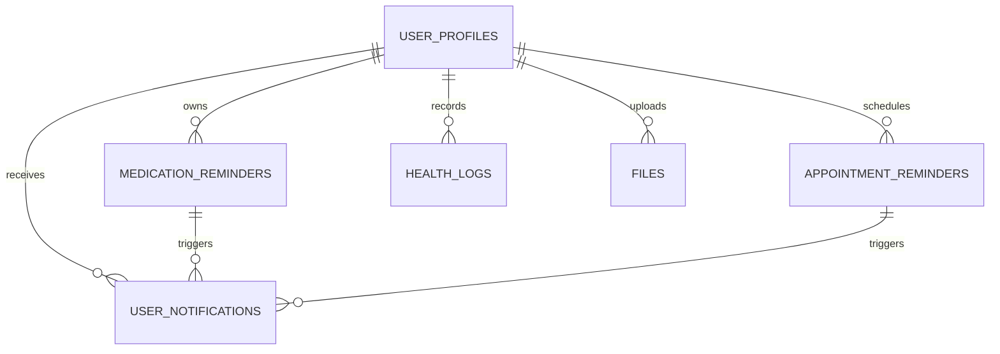
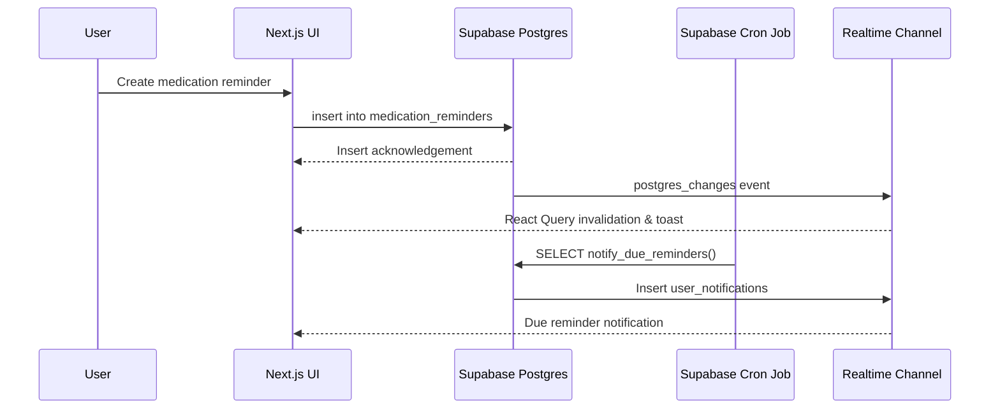
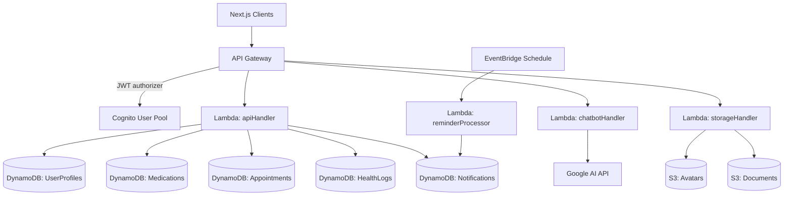

# SymptomSync Architecture

SymptomSync pairs a feature-rich Next.js client with Supabase's managed backend services and an optional AWS serverless stack. This document expands on the architectural choices, major data flows, and deployment pipelines that support the experience delivered at [symptomsync.vercel.app](https://symptomsync.vercel.app).

## 1. System Overview

```mermaid
flowchart TD
  subgraph Client[Next.js Client]
    Pages[Pages & Layouts]
    Components[UI Components<br/>(shadcn/ui + Tailwind)]
    Hooks[Hooks & Utilities]
    DataLayer[React Query + Supabase SDK]
  end

  subgraph Supabase[Supabase Cloud]
    Auth[Auth]
    Postgres[(Postgres + RLS)]
    Storage[File Storage]
    Realtime[Realtime Channels]
    Cron[pg_cron Scheduler]
    Functions[Stored Procedures]
  end

  subgraph Integrations[External Integrations]
    GoogleAI[Google AI<br/>(Generative API)]
  end

  Pages --> Components
  Components --> Hooks
  Hooks --> DataLayer
  DataLayer -->|RPC / REST| Postgres
  DataLayer -->|Auth| Auth
  DataLayer -->|Uploads| Storage
  Postgres -->|postgres_changes| Realtime
  Realtime --> DataLayer
  Cron -->|invoke functions| Functions
  Functions -->|stored procedures| Postgres
  Postgres -->|materialized data| Functions
  Cron -->|notify_due_reminders()| Postgres
  DataLayer -->|Symptom prompts| GoogleAI

  style Client fill:#E3F2FD,stroke:#0D47A1
  style Supabase fill:#E8F5E9,stroke:#1B5E20
  style Integrations fill:#FFF3E0,stroke:#FB8C00
```

## 2. Frontend Architecture

The `web/` workspace is a traditional Next.js **pages router** application. Routing files live in [`web/pages`](web/pages) and map to the core product experiences: `index.tsx` for marketing/login, `home.tsx` for the dashboard, `calendar.tsx`, `chat.tsx`, `uploads.tsx`, `profile.tsx`, etc. Shared layout concerns are handled via `_app.tsx` and `_document.tsx`.

Reusable presentation and interaction building blocks reside in [`web/components`](web/components), while domain-specific data access hooks/services are grouped in [`web/lib`](web/lib). These modules wrap the Supabase JavaScript SDK, React Query, form validation (Zod + React Hook Form), charting (Chart.js and Recharts), and utility helpers for tasks such as ICS import/export and barcode scanning.

```mermaid
graph LR
  A[index.tsx]
  B[home.tsx]
  C[calendar.tsx]
  D[chat.tsx]
  E[uploads.tsx]
  F[profile.tsx]
  G[reminder.tsx]
  Shared[_app.tsx / _document.tsx]
  Store[lib/ (Supabase clients, queries, mutations)]
  UI[components/ (UI primitives, charts, forms)]

  Shared --> A
  Shared --> B
  Shared --> C
  Shared --> D
  Shared --> E
  Shared --> F
  Shared --> G
  A --> Store
  B --> Store
  C --> Store
  D --> Store
  E --> Store
  F --> Store
  G --> Store
  Store --> UI
  UI --> Shared
```

## 3. Supabase Data Layer

Supabase provides authentication, the relational data model, storage buckets, and realtime capabilities. Core tables are defined under [`supabase/`](supabase/):

- [`user_profiles.sql`](supabase/user_profiles.sql) links each Supabase Auth user to profile metadata.
- [`medication_reminders.sql`](supabase/medication_reminders.sql) and [`appointment_reminders.sql`](supabase/appointment_reminders.sql) track schedules and notification flags.
- [`health_logs.sql`](supabase/health_logs.sql) captures symptom/mood/vital history.
- [`files.sql`](supabase/files.sql) persists uploaded document metadata.
- [`user_notifications.sql`](supabase/user_notifications.sql) stores reminder payloads generated by [`notify_due_reminders.sql`](supabase/notify_due_reminders.sql).

Row Level Security (RLS) policies (defined in Supabase, referenced in `README.md`) ensure every query is scoped to the authenticated `user_profile_id`. A trigger in [`user_profile_trigger.sql`](supabase/user_profile_trigger.sql) automatically provisions profiles when new accounts register. The [`cron.sql`](supabase/cron.sql) script schedules the `notify_due_reminders()` function to run every minute, scanning for overdue appointments/medications and recording entries in `user_notifications`.



## 4. Realtime Reminder Flow



## 5. Optional AWS Serverless Stack

For teams that need to self-host beyond Supabase, the `aws/` directory offers an AWS CDK stack that mirrors key capabilities defined in [`aws/lib/symptomsync-stack.js`](aws/lib/symptomsync-stack.js):

- Amazon Cognito User Pool for authentication.
- DynamoDB tables for profiles, medications, appointments, logs, and notifications.
- S3 buckets for `avatars` and `documents`.
- Node.js Lambda functions for REST APIs (`apiHandler.js`), reminder processing, chatbot integration, and storage operations.
- API Gateway REST endpoints secured with Cognito authorizers.
- EventBridge scheduled rule that invokes the reminder processor every minute.



## 6. DevOps & Automation

Continuous integration and delivery are orchestrated through [`.github/workflows/ci.yml`](.github/workflows/ci.yml). The workflow stages include linting/formatting, dependency caching, security scans, a Node.js version matrix test run, static Next.js builds, Docker image publication to GHCR, Trivy scans, optional performance checks, and infrastructure deployment via Ansible + AWS CDK.

```mermaid
flowchart LR
  Commit[Commit / PR]
  Trigger[GitHub Actions]
  Lint[Format & Lint]
  Cache[Cache Dependencies]
  Security[Security & License Scan]
  Tests[Unit & E2E Tests]
  Build[Next.js Build]
  Image[Docker Build & Push]
  Scan[Trivy Image Scan]
  Perf[Performance Benchmark]
  Deploy[AWS CDK + Ansible Deploy]
  Summary[Pipeline Summary]

  Commit --> Trigger --> Lint --> Cache --> Security --> Tests --> Build --> Image --> Scan --> Perf --> Deploy --> Summary
```



Together, these layers deliver a responsive patient-facing experience with secure data handling, real-time collaboration, and repeatable infrastructure automation.
