# SymptomSync Architecture

SymptomSync is a multi-surface system with a Next.js pages-router frontend (`web/`), a Supabase-backed operational data plane (`supabase/` + mirrored SQL in `database/`), an optional standalone Agentic AI MCP service (`agentic_ai/`), and optional AWS infrastructure (`aws/`, `ansible/`, `jenkins/`).

This document is implementation-backed: claims here map to checked-in code paths.

## Table of Contents

- [1. System Context](#1-system-context)
- [2. Repository Topology and Ownership Boundaries](#2-repository-topology-and-ownership-boundaries)
- [3. Frontend Runtime Architecture (`web/`)](#3-frontend-runtime-architecture-web)
- [4. Supabase Data Architecture](#4-supabase-data-architecture)
- [5. Agentic AI Service Architecture (`agentic_ai/`)](#5-agentic-ai-service-architecture-agentic_ai)
- [6. Security and Trust Boundaries](#6-security-and-trust-boundaries)
- [7. Deployment Topologies](#7-deployment-topologies)
- [8. CI/CD and Release Automation](#8-cicd-and-release-automation)
- [9. Observability and Operations](#9-observability-and-operations)
- [10. Change Impact Map](#10-change-impact-map)

## 1. System Context

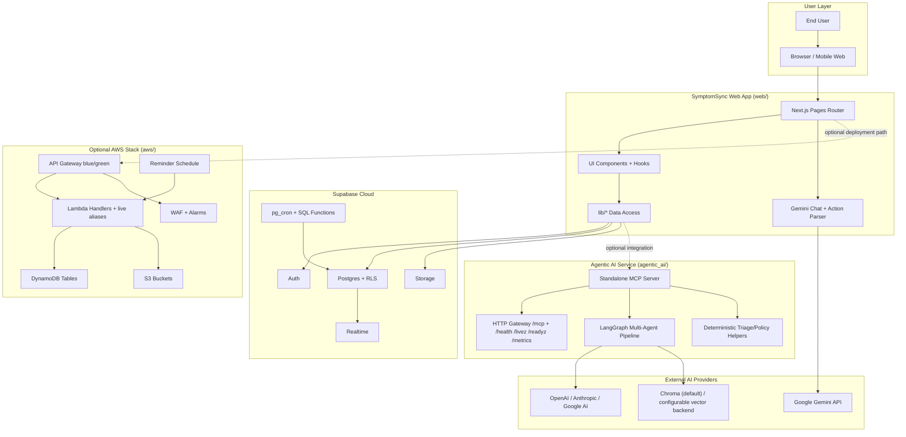
```mermaid
flowchart TD
  subgraph UserLayer["User Layer"]
    User["End User"]
    Browser["Browser / Mobile Web"]
  end

  subgraph WebApp["SymptomSync Web App (web/)"]
    NextPages["Next.js Pages Router"]
    UILib["UI Components + Hooks"]
    WebData["lib/* Data Access"]
    ChatRuntime["Gemini Chat + Action Parser"]
  end

  subgraph SupabaseCloud["Supabase Cloud"]
    SBAAuth["Auth"]
    SBADB["Postgres + RLS"]
    SBAStore["Storage"]
    SBARealtime["Realtime"]
    SBACron["pg_cron + SQL Functions"]
  end

  subgraph AgenticAI["Agentic AI Service (agentic_ai/)"]
    MCP["Standalone MCP Server"]
    MCPHTTP["HTTP Gateway /mcp + /health /livez /readyz /metrics"]
    GraphPipeline["LangGraph Multi-Agent Pipeline"]
    DecisionSupport["Deterministic Triage/Policy Helpers"]
  end

  subgraph OptionalAWS["Optional AWS Stack (aws/)"]
    APIGW["API Gateway blue/green"]
    Lambdas["Lambda Handlers + live aliases"]
    DDB["DynamoDB Tables"]
    S3["S3 Buckets"]
    EventBridge["Reminder Schedule"]
    WAF["WAF + Alarms"]
  end

  subgraph ExternalAI["External AI Providers"]
    Gemini["Google Gemini API"]
    LLMs["OpenAI / Anthropic / Google AI"]
    VectorStore["Chroma (default) / configurable vector backend"]
  end

  User --> Browser --> NextPages
  NextPages --> UILib --> WebData
  NextPages --> ChatRuntime
  WebData --> SBAAuth
  WebData --> SBADB
  WebData --> SBAStore
  SBADB --> SBARealtime
  SBACron --> SBADB
  ChatRuntime --> Gemini

  WebData -. optional integration .-> MCP
  MCP --> MCPHTTP
  MCP --> GraphPipeline
  MCP --> DecisionSupport
  GraphPipeline --> LLMs
  GraphPipeline --> VectorStore

  NextPages -. optional deployment path .-> APIGW
  APIGW --> Lambdas
  Lambdas --> DDB
  Lambdas --> S3
  EventBridge --> Lambdas
  APIGW --> WAF
```

## 2. Repository Topology and Ownership Boundaries

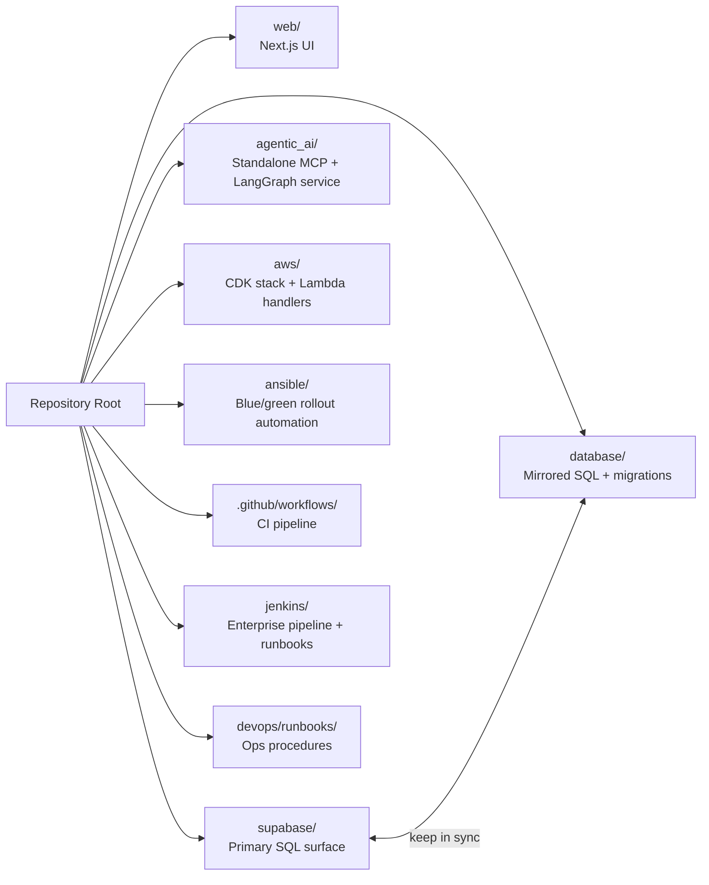
```mermaid
flowchart LR
  Root["Repository Root"]

  Root --> Web["web/\nNext.js UI"]
  Root --> SupabaseSQL["supabase/\nPrimary SQL surface"]
  Root --> MirrorSQL["database/\nMirrored SQL + migrations"]
  Root --> Agentic["agentic_ai/\nStandalone MCP + LangGraph service"]
  Root --> AWS["aws/\nCDK stack + Lambda handlers"]
  Root --> Ansible["ansible/\nBlue/green rollout automation"]
  Root --> GH[".github/workflows/\nCI pipeline"]
  Root --> Jenkins["jenkins/\nEnterprise pipeline + runbooks"]
  Root --> DevOps["devops/runbooks/\nOps procedures"]

  SupabaseSQL <-->|"keep in sync"| MirrorSQL
```

## 3. Frontend Runtime Architecture (`web/`)

The frontend is a pages-router Next.js app. High-traffic surfaces include:

- `pages/home.tsx`: reminders/log dashboards, realtime subscriptions, CRUD workflows.
- `pages/calendar.tsx`: calendar rendering, recurrence expansion, ICS import/export.
- `pages/chat.tsx`: chat UX, user-context hydration, action payload parsing and apply flow.
- `pages/uploads.tsx`, `pages/profile.tsx`, `pages/reminder.tsx`: documents/profile/reminder management.
- `lib/*`: Supabase-backed data functions and client-side integrations.

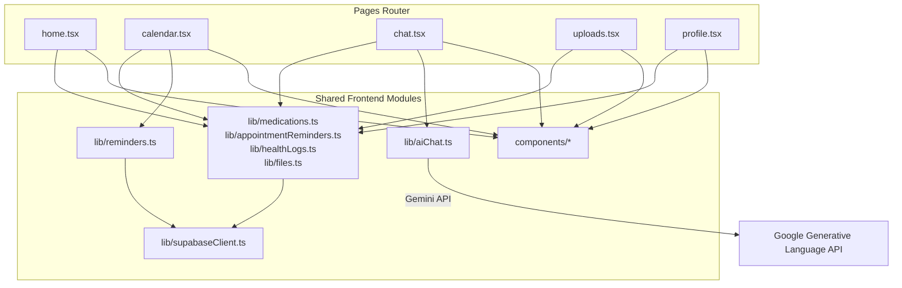
```mermaid
flowchart TB
  subgraph Pages["Pages Router"]
    Home["home.tsx"]
    Calendar["calendar.tsx"]
    Chat["chat.tsx"]
    Uploads["uploads.tsx"]
    Profile["profile.tsx"]
  end

  subgraph Shared["Shared Frontend Modules"]
    SupabaseClient["lib/supabaseClient.ts"]
    DataLib["lib/medications.ts\nlib/appointmentReminders.ts\nlib/healthLogs.ts\nlib/files.ts"]
    ReminderLib["lib/reminders.ts"]
    AIChatLib["lib/aiChat.ts"]
    UIComponents["components/*"]
  end

  Home --> DataLib
  Calendar --> DataLib
  Calendar --> ReminderLib
  Chat --> DataLib
  Chat --> AIChatLib
  Uploads --> DataLib
  Profile --> DataLib

  DataLib --> SupabaseClient
  ReminderLib --> SupabaseClient
  AIChatLib -->|"Gemini API"| GeminiAPI["Google Generative Language API"]

  Home --> UIComponents
  Calendar --> UIComponents
  Chat --> UIComponents
  Uploads --> UIComponents
  Profile --> UIComponents
```

### 3.1 Chat Action Execution Flow

`web/pages/chat.tsx` performs a concrete action loop: it asks Gemini for a response, parses an explicit fenced `symptomsync-action` block, and applies validated CRUD operations for appointments, medications, and health logs.

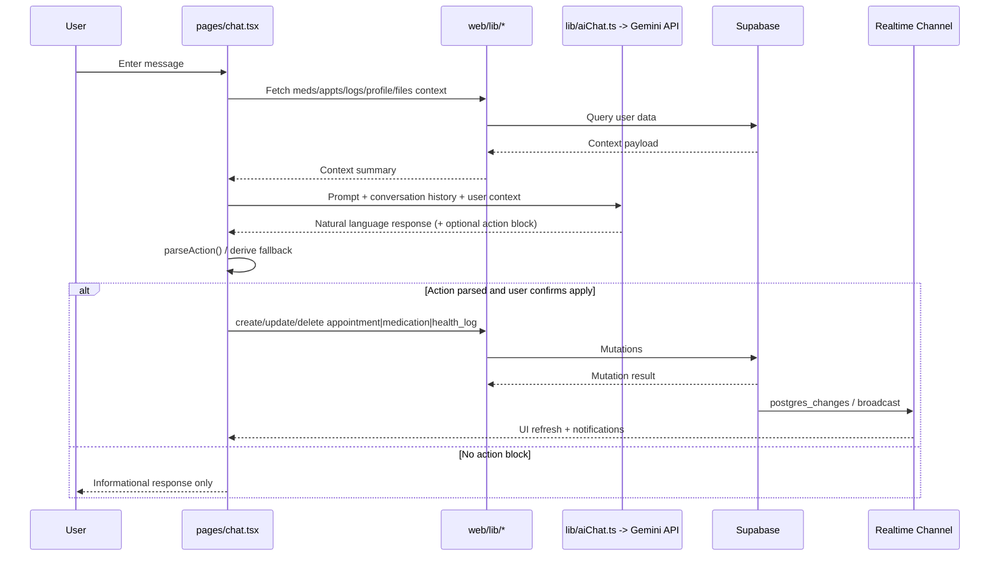
```mermaid
sequenceDiagram
  participant User
  participant ChatPage as pages/chat.tsx
  participant Libs as web/lib/*
  participant Gemini as lib/aiChat.ts -> Gemini API
  participant Supabase as Supabase
  participant Realtime as Realtime Channel

  User->>ChatPage: Enter message
  ChatPage->>Libs: Fetch meds/appts/logs/profile/files context
  Libs->>Supabase: Query user data
  Supabase-->>Libs: Context payload
  Libs-->>ChatPage: Context summary

  ChatPage->>Gemini: Prompt + conversation history + user context
  Gemini-->>ChatPage: Natural language response (+ optional action block)
  ChatPage->>ChatPage: parseAction() / derive fallback

  alt Action parsed and user confirms apply
    ChatPage->>Libs: create/update/delete appointment|medication|health_log
    Libs->>Supabase: Mutations
    Supabase-->>Libs: Mutation result
    Supabase->>Realtime: postgres_changes / broadcast
    Realtime-->>ChatPage: UI refresh + notifications
  else No action block
    ChatPage-->>User: Informational response only
  end
```

## 4. Supabase Data Architecture

Supabase is the operational system of record for the default hosted app path.

Core entities and SQL definitions are in `supabase/*.sql` (with mirrored counterparts in `database/`):

- `user_profiles`
- `medication_reminders`
- `appointment_reminders`
- `health_logs`
- `files`
- `user_notifications`
- procedural logic: `notify_due_reminders()` and related trigger/cron SQL.

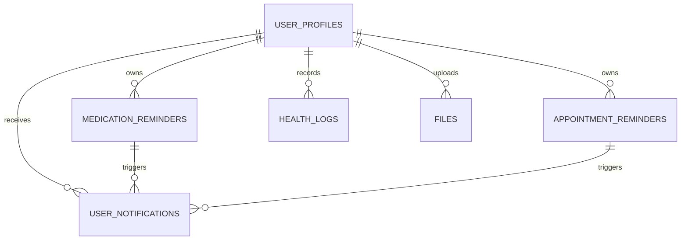
```mermaid
erDiagram
  USER_PROFILES ||--o{ MEDICATION_REMINDERS : owns
  USER_PROFILES ||--o{ APPOINTMENT_REMINDERS : owns
  USER_PROFILES ||--o{ HEALTH_LOGS : records
  USER_PROFILES ||--o{ FILES : uploads
  USER_PROFILES ||--o{ USER_NOTIFICATIONS : receives

  MEDICATION_REMINDERS ||--o{ USER_NOTIFICATIONS : triggers
  APPOINTMENT_REMINDERS ||--o{ USER_NOTIFICATIONS : triggers
```

### 4.1 SQL Surface Mirror Model

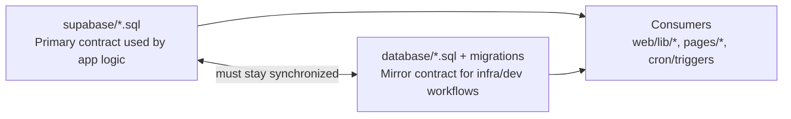
```mermaid
flowchart LR
  SupabaseDir["supabase/*.sql\nPrimary contract used by app logic"]
  DatabaseDir["database/*.sql + migrations\nMirror contract for infra/dev workflows"]
  Consumers["Consumers\nweb/lib/*, pages/*, cron/triggers"]

  SupabaseDir --> Consumers
  DatabaseDir --> Consumers
  SupabaseDir <-->|"must stay synchronized"| DatabaseDir
```

### 4.2 Reminder Lifecycle

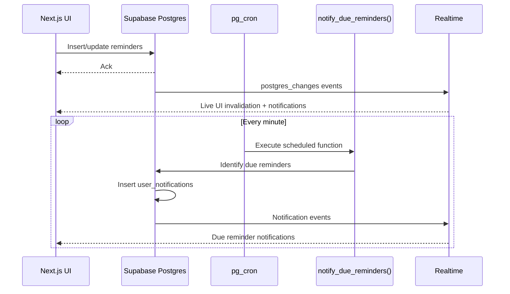
```mermaid
sequenceDiagram
  participant UI as Next.js UI
  participant DB as Supabase Postgres
  participant Cron as pg_cron
  participant Fn as notify_due_reminders()
  participant RT as Realtime

  UI->>DB: Insert/update reminders
  DB-->>UI: Ack
  DB->>RT: postgres_changes events
  RT-->>UI: Live UI invalidation + notifications

  loop Every minute
    Cron->>Fn: Execute scheduled function
    Fn->>DB: Identify due reminders
    DB->>DB: Insert user_notifications
    DB->>RT: Notification events
    RT-->>UI: Due reminder notifications
  end
```

## 5. Agentic AI Service Architecture (`agentic_ai/`)

The service is a standalone Python runtime with modular MCP registration and a graph-backed orchestration layer.

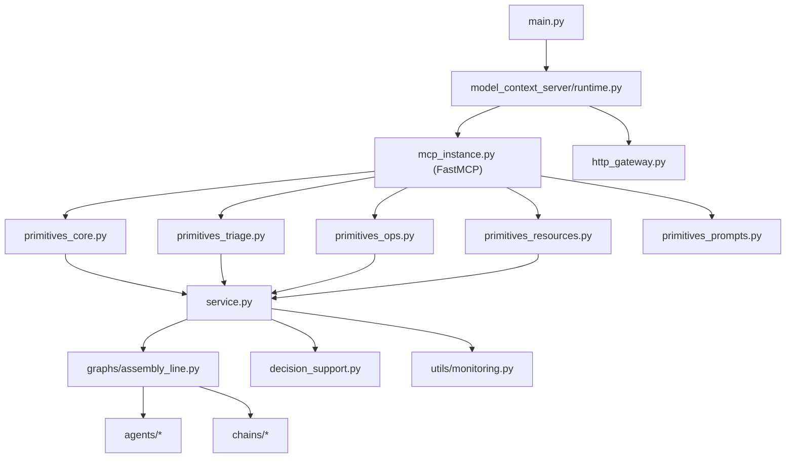
```mermaid
flowchart TB
  Main["main.py"] --> Runtime["model_context_server/runtime.py"]
  Runtime --> MCPInstance["mcp_instance.py (FastMCP)"]
  Runtime --> HTTPGateway["http_gateway.py"]

  MCPInstance --> PrimitivesCore["primitives_core.py"]
  MCPInstance --> PrimitivesTriage["primitives_triage.py"]
  MCPInstance --> PrimitivesOps["primitives_ops.py"]
  MCPInstance --> PrimitivesResources["primitives_resources.py"]
  MCPInstance --> PrimitivesPrompts["primitives_prompts.py"]

  PrimitivesCore --> Service["service.py"]
  PrimitivesTriage --> Service
  PrimitivesOps --> Service
  PrimitivesResources --> Service

  Service --> Graph["graphs/assembly_line.py"]
  Service --> DecisionSupport["decision_support.py"]
  Service --> Metrics["utils/monitoring.py"]
  Graph --> Agents["agents/*"]
  Graph --> Chains["chains/*"]
```

### 5.1 MCP Primitive Surface Map

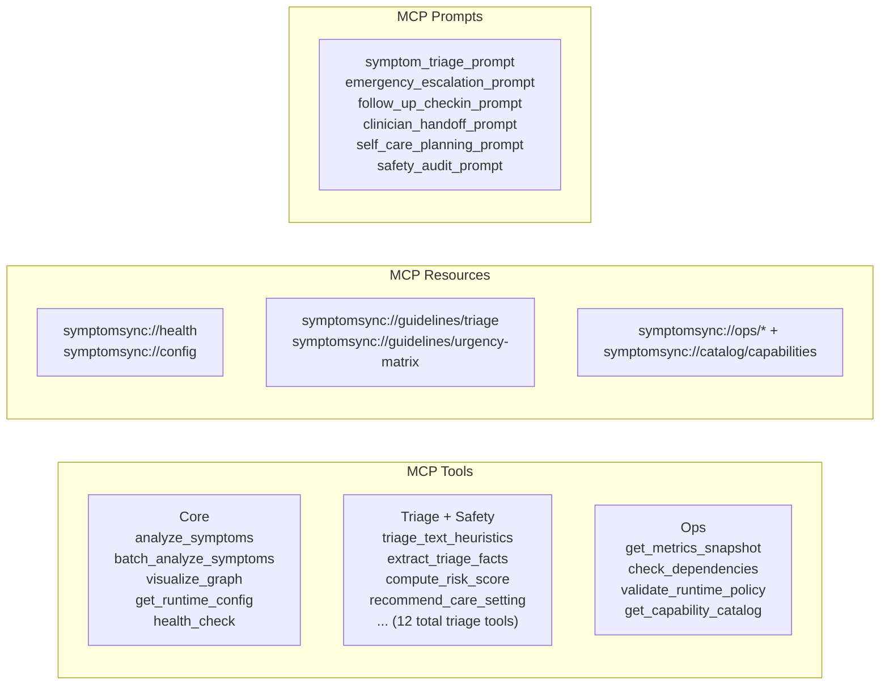
```mermaid
flowchart LR
  subgraph Tools["MCP Tools"]
    CoreTools["Core\nanalyze_symptoms\nbatch_analyze_symptoms\nvisualize_graph\nget_runtime_config\nhealth_check"]
    TriageTools["Triage + Safety\ntriage_text_heuristics\nextract_triage_facts\ncompute_risk_score\nrecommend_care_setting\n... (12 total triage tools)"]
    OpsTools["Ops\nget_metrics_snapshot\ncheck_dependencies\nvalidate_runtime_policy\nget_capability_catalog"]
  end

  subgraph Resources["MCP Resources"]
    CoreRes["symptomsync://health\nsymptomsync://config"]
    TriageRes["symptomsync://guidelines/triage\nsymptomsync://guidelines/urgency-matrix"]
    OpsRes["symptomsync://ops/* + symptomsync://catalog/capabilities"]
  end

  subgraph Prompts["MCP Prompts"]
    PromptSet["symptom_triage_prompt\nemergency_escalation_prompt\nfollow_up_checkin_prompt\nclinician_handoff_prompt\nself_care_planning_prompt\nsafety_audit_prompt"]
  end
```

### 5.2 MCP Request Execution Path

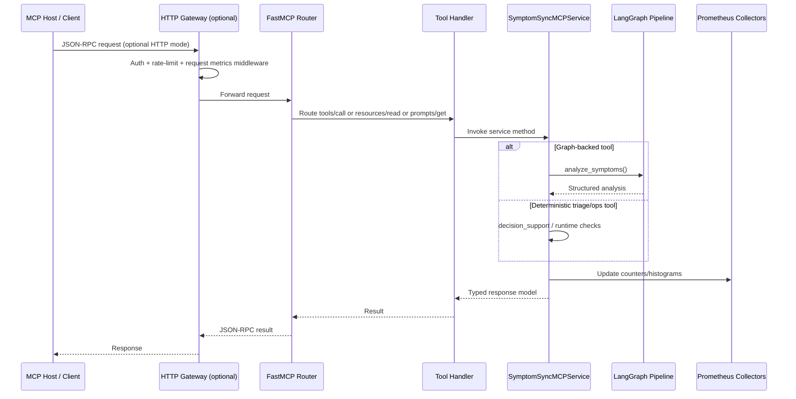
```mermaid
sequenceDiagram
  participant Host as MCP Host / Client
  participant Gateway as HTTP Gateway (optional)
  participant MCP as FastMCP Router
  participant Primitive as Tool Handler
  participant Service as SymptomSyncMCPService
  participant Graph as LangGraph Pipeline
  participant Metrics as Prometheus Collectors

  Host->>Gateway: JSON-RPC request (optional HTTP mode)
  Gateway->>Gateway: Auth + rate-limit + request metrics middleware
  Gateway->>MCP: Forward request
  MCP->>Primitive: Route tools/call or resources/read or prompts/get
  Primitive->>Service: Invoke service method

  alt Graph-backed tool
    Service->>Graph: analyze_symptoms()
    Graph-->>Service: Structured analysis
  else Deterministic triage/ops tool
    Service->>Service: decision_support / runtime checks
  end

  Service->>Metrics: Update counters/histograms
  Service-->>Primitive: Typed response model
  Primitive-->>MCP: Result
  MCP-->>Gateway: JSON-RPC result
  Gateway-->>Host: Response
```

### 5.3 LangGraph Orchestration State Model

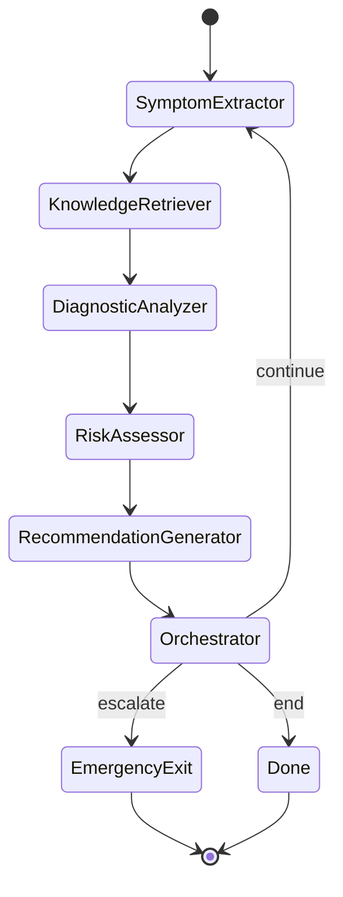
```mermaid
stateDiagram-v2
  [*] --> SymptomExtractor
  SymptomExtractor --> KnowledgeRetriever
  KnowledgeRetriever --> DiagnosticAnalyzer
  DiagnosticAnalyzer --> RiskAssessor
  RiskAssessor --> RecommendationGenerator
  RecommendationGenerator --> Orchestrator

  Orchestrator --> SymptomExtractor: continue
  Orchestrator --> EmergencyExit: escalate
  Orchestrator --> Done: end

  EmergencyExit --> [*]
  Done --> [*]
```

### 5.4 Deterministic Triage Decision Flow

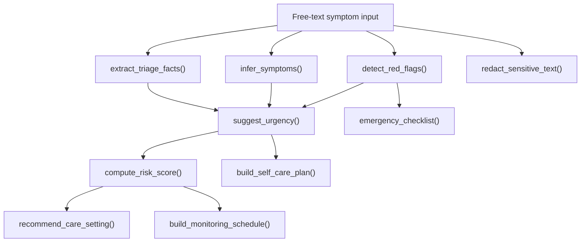
```mermaid
flowchart TD
  Input["Free-text symptom input"] --> RedFlags["detect_red_flags()"]
  Input --> Symptoms["infer_symptoms()"]
  Input --> Facts["extract_triage_facts()"]

  RedFlags --> Urgency["suggest_urgency()"]
  Symptoms --> Urgency
  Facts --> Urgency

  Urgency --> RiskScore["compute_risk_score()"]
  RiskScore --> CareSetting["recommend_care_setting()"]
  RiskScore --> Monitoring["build_monitoring_schedule()"]
  Urgency --> SelfCare["build_self_care_plan()"]

  RedFlags --> Emergency["emergency_checklist()"]
  Input --> Redaction["redact_sensitive_text()"]
```

## 6. Security and Trust Boundaries

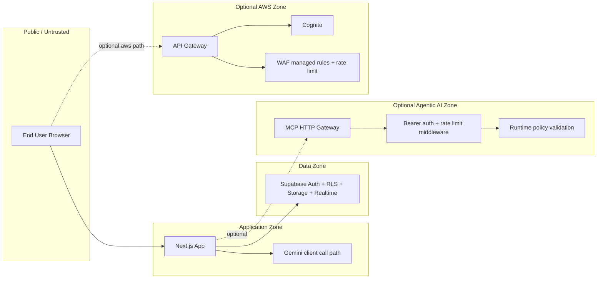
```mermaid
flowchart LR
  subgraph PublicZone["Public / Untrusted"]
    EndUser["End User Browser"]
  end

  subgraph AppZone["Application Zone"]
    NextApp["Next.js App"]
    ChatClient["Gemini client call path"]
  end

  subgraph DataZone["Data Zone"]
    SBA["Supabase Auth + RLS + Storage + Realtime"]
  end

  subgraph AIServiceZone["Optional Agentic AI Zone"]
    MCPHTTP["MCP HTTP Gateway"]
    MCPAuth["Bearer auth + rate limit middleware"]
    MCPRuntime["Runtime policy validation"]
  end

  subgraph InfraZone["Optional AWS Zone"]
    APIGateway["API Gateway"]
    Cognito["Cognito"]
    WAF["WAF managed rules + rate limit"]
  end

  EndUser --> NextApp
  NextApp --> SBA
  NextApp --> ChatClient
  NextApp -. optional .-> MCPHTTP
  MCPHTTP --> MCPAuth --> MCPRuntime

  EndUser -. optional aws path .-> APIGateway
  APIGateway --> Cognito
  APIGateway --> WAF
```

Current control points implemented in code:

- Supabase RLS for per-user data isolation.
- MCP HTTP auth toggle (`SYMPTOMSYNC_MCP_REQUIRE_AUTH`) + bearer token validation (`SYMPTOMSYNC_MCP_AUTH_TOKEN`).
- Per-identity HTTP rate limiting (`SYMPTOMSYNC_RATE_LIMIT_PER_MINUTE`).
- Runtime fail-fast protections for unsafe staging/production streamable-HTTP startup.
- Deterministic text redaction tool for common PII patterns in handoff content.

## 7. Deployment Topologies

### 7.1 Default Hosted Topology (Vercel + Supabase)

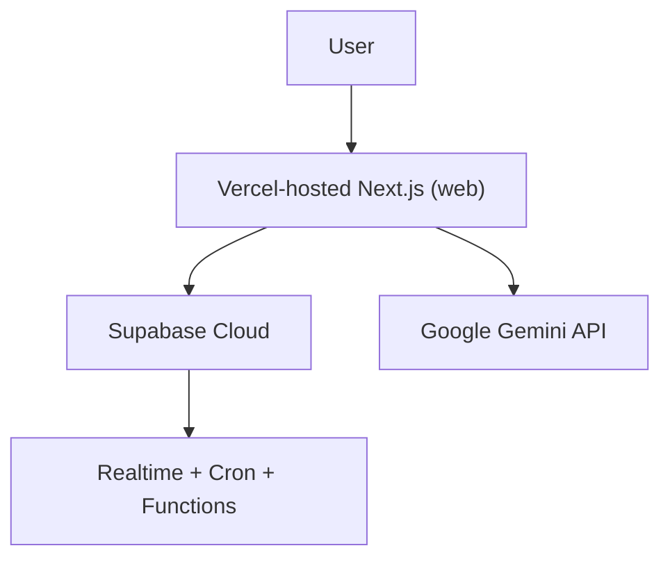
```mermaid
flowchart TB
  User["User"] --> Vercel["Vercel-hosted Next.js (web)"]
  Vercel --> Supabase["Supabase Cloud"]
  Vercel --> Gemini["Google Gemini API"]
  Supabase --> Realtime["Realtime + Cron + Functions"]
```

### 7.2 Optional AWS Serverless Topology

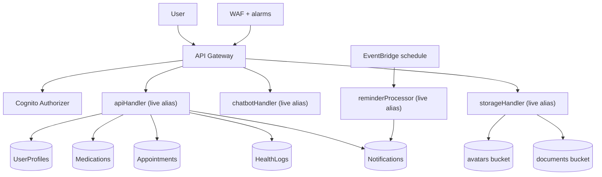
```mermaid
flowchart TB
  User["User"] --> APIGW["API Gateway"]
  APIGW --> Cognito["Cognito Authorizer"]
  APIGW --> ApiLambda["apiHandler (live alias)"]
  APIGW --> ChatLambda["chatbotHandler (live alias)"]
  APIGW --> StorageLambda["storageHandler (live alias)"]

  ApiLambda --> DDB1[(UserProfiles)]
  ApiLambda --> DDB2[(Medications)]
  ApiLambda --> DDB3[(Appointments)]
  ApiLambda --> DDB4[(HealthLogs)]
  ApiLambda --> DDB5[(Notifications)]

  StorageLambda --> S3A[(avatars bucket)]
  StorageLambda --> S3D[(documents bucket)]

  EventBridge["EventBridge schedule"] --> ReminderLambda["reminderProcessor (live alias)"]
  ReminderLambda --> DDB5

  WAF["WAF + alarms"] --> APIGW
```

### 7.3 Blue/Green + Canary Promotion Model

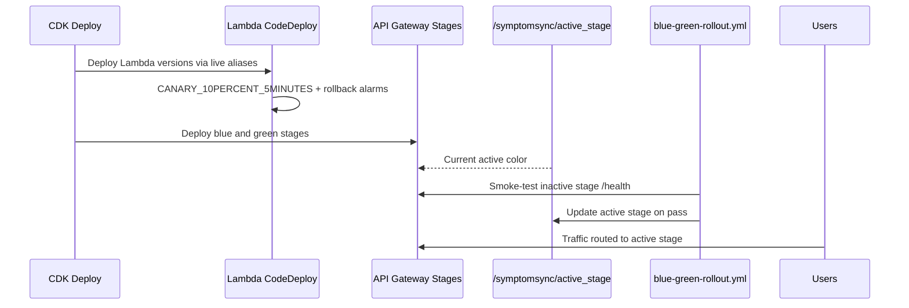
```mermaid
sequenceDiagram
  participant CDK as CDK Deploy
  participant CodeDeploy as Lambda CodeDeploy
  participant API as API Gateway Stages
  participant SSM as /symptomsync/active_stage
  participant Ansible as blue-green-rollout.yml
  participant Users

  CDK->>CodeDeploy: Deploy Lambda versions via live aliases
  CodeDeploy->>CodeDeploy: CANARY_10PERCENT_5MINUTES + rollback alarms

  CDK->>API: Deploy blue and green stages
  SSM-->>API: Current active color

  Ansible->>API: Smoke-test inactive stage /health
  Ansible->>SSM: Update active stage on pass

  Users->>API: Traffic routed to active stage
```

## 8. CI/CD and Release Automation

Two pipelines are maintained:

- GitHub Actions: `.github/workflows/ci.yml`
- Jenkins: `jenkins/Jenkinsfile`

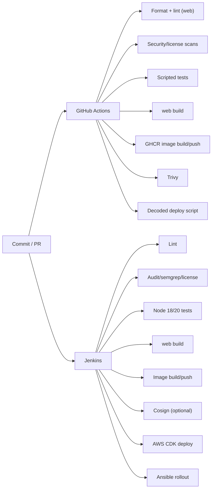
```mermaid
flowchart LR
  Commit["Commit / PR"] --> GHA["GitHub Actions"]
  Commit --> Jenkins["Jenkins"]

  GHA --> GHALint["Format + lint (web)"]
  GHA --> GHASec["Security/license scans"]
  GHA --> GHATest["Scripted tests"]
  GHA --> GHABuild["web build"]
  GHA --> GHADocker["GHCR image build/push"]
  GHA --> GHAScan["Trivy"]
  GHA --> GHADeploy["Decoded deploy script"]

  Jenkins --> JLint["Lint"]
  Jenkins --> JSec["Audit/semgrep/license"]
  Jenkins --> JTest["Node 18/20 tests"]
  Jenkins --> JBuild["web build"]
  Jenkins --> JDocker["Image build/push"]
  Jenkins --> JSign["Cosign (optional)"]
  Jenkins --> JCDK["AWS CDK deploy"]
  Jenkins --> JRoll["Ansible rollout"]
```

## 9. Observability and Operations

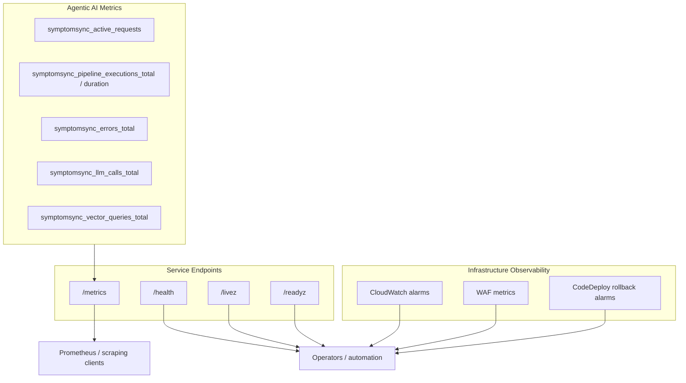
```mermaid
flowchart TD
  subgraph AppMetrics["Agentic AI Metrics"]
    Requests["symptomsync_active_requests"]
    Pipeline["symptomsync_pipeline_executions_total / duration"]
    Errors["symptomsync_errors_total"]
    LLMCalls["symptomsync_llm_calls_total"]
    VectorQueries["symptomsync_vector_queries_total"]
  end

  subgraph EndpointLayer["Service Endpoints"]
    Health["/health"]
    Livez["/livez"]
    Readyz["/readyz"]
    Metrics["/metrics"]
  end

  subgraph InfraObs["Infrastructure Observability"]
    CW["CloudWatch alarms"]
    WAFMetrics["WAF metrics"]
    DeployAlarms["CodeDeploy rollback alarms"]
  end

  AppMetrics --> Metrics
  Health --> Operator["Operators / automation"]
  Livez --> Operator
  Readyz --> Operator
  Metrics --> Prom["Prometheus / scraping clients"]

  CW --> Operator
  WAFMetrics --> Operator
  DeployAlarms --> Operator
```

Operational checks that should be considered mandatory before production cutover:

- `web/`: `npm run lint` and `npm run build`
- `agentic_ai/`: `make lint` and `make test`
- deploy/traffic-shift checks: smoke `/health` on inactive stage before SSM cutover

## 10. Change Impact Map

This section defines where changes must be propagated to keep architecture contracts consistent.

### 10.1 Typical Change Paths

- **Frontend feature UI only**:
  - `web/pages/*`, `web/components/*`, `web/lib/*`
  - validate with `cd web && npm run lint && npm run build`
- **Data contract / schema change**:
  - update **both** `supabase/` and `database/` SQL surfaces
  - update all consumers in `web/lib/*`, affected pages, and runbooks/docs as needed
- **Agentic AI behavior/tooling change**:
  - `agentic_ai/model_context_server/*`, `agentic_ai/service.py`, `agentic_ai/graphs/*`, `agentic_ai/agents/*`
  - validate with `cd agentic_ai && make lint && make test`
- **Deploy/traffic-shift behavior change**:
  - `.github/workflows/ci.yml`, `jenkins/Jenkinsfile`, `ansible/blue-green-rollout.yml`, `aws/lib/symptomsync-stack.js`
  - verify rollout logic and runbook alignment

### 10.2 Change Routing Decision Flow

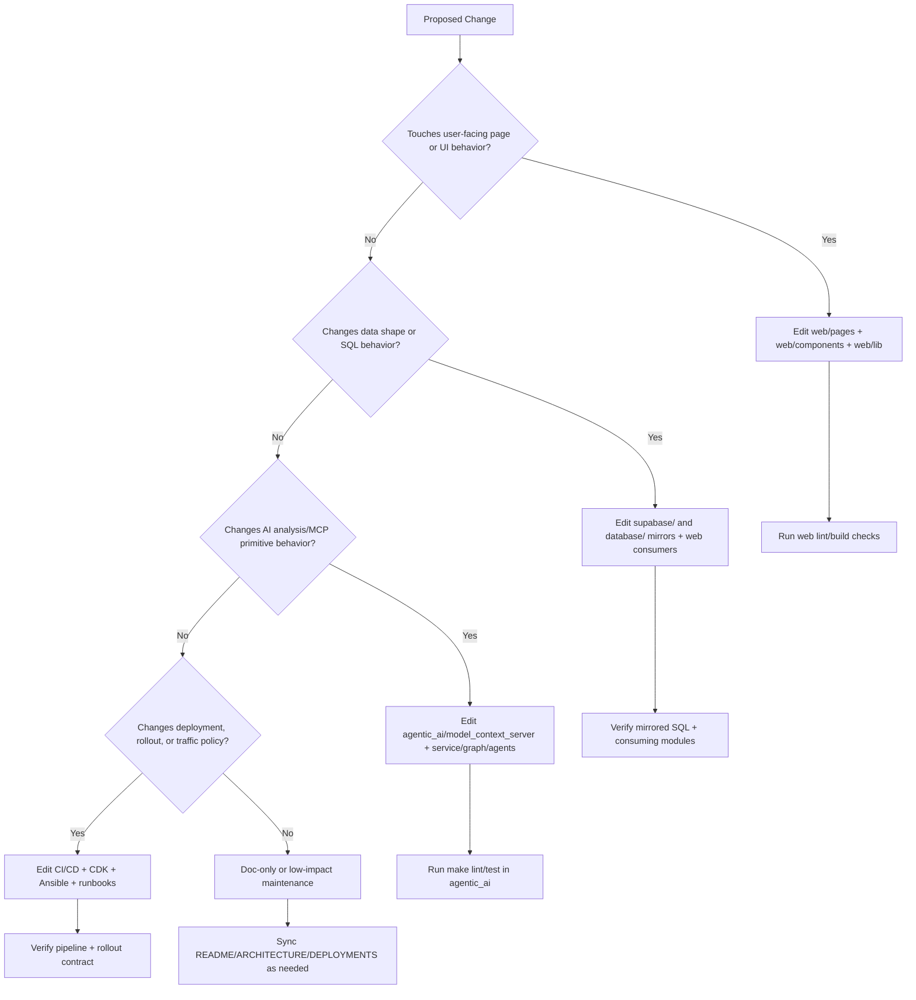
```mermaid
flowchart TD
  Start["Proposed Change"] --> Q1{"Touches user-facing page or UI behavior?"}
  Q1 -->|Yes| WebPath["Edit web/pages + web/components + web/lib"]
  Q1 -->|No| Q2{"Changes data shape or SQL behavior?"}

  Q2 -->|Yes| DataPath["Edit supabase/ and database/ mirrors + web consumers"]
  Q2 -->|No| Q3{"Changes AI analysis/MCP primitive behavior?"}

  Q3 -->|Yes| AIPath["Edit agentic_ai/model_context_server + service/graph/agents"]
  Q3 -->|No| Q4{"Changes deployment, rollout, or traffic policy?"}

  Q4 -->|Yes| ReleasePath["Edit CI/CD + CDK + Ansible + runbooks"]
  Q4 -->|No| DocsPath["Doc-only or low-impact maintenance"]

  WebPath --> ValidateWeb["Run web lint/build checks"]
  DataPath --> ValidateData["Verify mirrored SQL + consuming modules"]
  AIPath --> ValidateAI["Run make lint/test in agentic_ai"]
  ReleasePath --> ValidateRelease["Verify pipeline + rollout contract"]
  DocsPath --> ValidateDocs["Sync README/ARCHITECTURE/DEPLOYMENTS as needed"]
```
