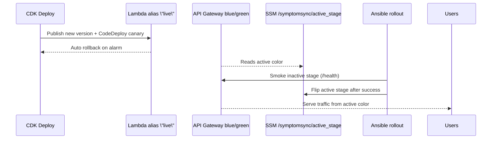

# Deployments & Progressive Delivery

This project ships with production-ready delivery flows that combine canary Lambda deploys, blue/green API Gateway stages, and automated promotion via Jenkins + Ansible. This doc explains how to deploy safely and roll back quickly.

## Paths to production
- **AWS (primary)**: CDK stack in `aws/` provisions Cognito, DynamoDB, S3 (encrypted/retained), Lambda functions fronted by `live` aliases, API Gateway with `blue` and `green` stages, EventBridge scheduler, and SSM flag `/symptomsync/active_stage`.
- **Vercel (marketing/UI)**: Next.js UI can still be hosted on Vercel; AWS stack handles authenticated API + reminders.

## Pipelines
- **Jenkins** (`jenkins/Jenkinsfile`): stages for lint/test/build, image push, Trivy scan, optional Cosign signing, CDK deploy (`npx cdk deploy --require-approval never --all`), and blue/green promotion via Ansible.
- **Ansible**: `ansible/blue-green-rollout.yml` smoke-tests the inactive color, then flips `/symptomsync/active_stage` after a successful health check.

```mermaid
flowchart LR
  Commit --> Jenkins[CI pipeline]
  Jenkins --> LintTests[Lint, tests]
  Jenkins --> BuildImg[Build & push image]
  BuildImg --> Scan[Trivy scan]
  Scan --> Sign[Cosign sign?]
  Sign --> CDK[CDK deploy (canary Lambdas + blue/green API)]
  CDK --> Promote[Ansible blue/green promotion]
  Promote --> Live[Active stage updated]
```

## Progressive delivery model
- **Canary**: Each Lambda is deployed via CodeDeploy `CANARY_10PERCENT_5MINUTES` with CloudWatch alarms; automatic rollback on errors during bake.
- **Blue/Green**: API Gateway exposes `blue` and `green` stages. The active color is controlled by SSM (`/symptomsync/active_stage`) and should be wired to DNS/BasePath mappings.
- **Health checks**: Default smoke path `/health` (override with `SMOKE_PATH`).



## Deploying
1) **Prereqs**
   - AWS credentials (`AWS_PROFILE` or keys) with permissions for CDK/CloudFormation/SSM/CodeDeploy.
   - `GOOGLE_AI_API_KEY` exported for Lambda envs.
   - Optional: `COSIGN_KEY` on Jenkins agents for image signing.
2) **Infrastructure + app**
   ```bash
   cd aws
   npm ci
   npx cdk deploy --require-approval never --all
   ```
3) **Promote inactive color**
   ```bash
   AWS_REGION=us-east-1 ansible-playbook ansible/blue-green-rollout.yml
   # force a target: TARGET_STAGE=green ansible-playbook ...
   ```

## Rollback
- **Canary rollback**: CodeDeploy auto-rolls back on alarm; to stop manually:
  ```bash
  aws deploy stop-deployment --deployment-id <id>
  ```
- **Blue/green rollback**: Reset the SSM flag to the prior color and update DNS/BasePath accordingly:
  ```bash
  aws ssm put-parameter --name /symptomsync/active_stage --type String --overwrite --value blue
  ```

## Observability & guardrails
- Monitor Lambda `Errors`/`Throttles` on the `live` aliases and API Gateway 4XX/5XX per stage (CloudWatch alarms are provisioned for 5XX and p95 latency per stage).
- Keep WAF enabled on API Gateway; managed rule set + rate limit (2k rpm) are applied by CDK.
- Buckets are encrypted and retained; no public access by default.
- Sign images when possible: `cosign sign ghcr.io/<org>/symptomsync:<tag>`.

## Artifacts and references
- Infra: `aws/lib/symptomsync-stack.js`
- Pipeline: `jenkins/Jenkinsfile`, `jenkins/README.md`
- Promotion playbook: `ansible/blue-green-rollout.yml`
- Runbooks: `devops/runbooks/progressive-delivery.md`, `devops/runbooks/production-readiness.md`
