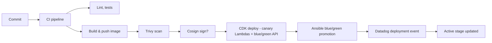
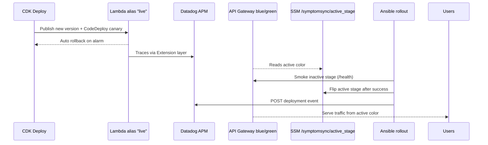
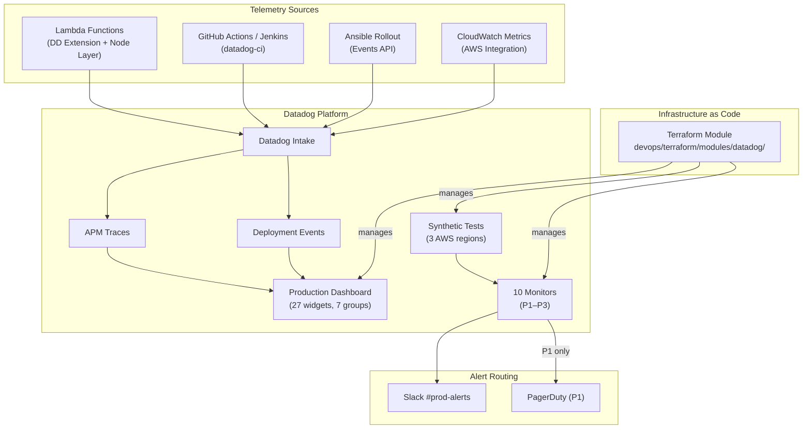

# Deployments & Progressive Delivery

This project ships with production-ready delivery flows that combine canary Lambda deploys, blue/green API Gateway stages, and automated promotion via Jenkins + Ansible. This doc explains how to deploy safely and roll back quickly.

## Paths to production
- **AWS (primary)**: CDK stack in `aws/` provisions Cognito, DynamoDB, S3 (encrypted/retained), Lambda functions fronted by `live` aliases, API Gateway with `blue` and `green` stages, EventBridge scheduler, and SSM flag `/symptomsync/active_stage`.
- **Vercel (marketing/UI)**: Next.js UI can still be hosted on Vercel; AWS stack handles authenticated API + reminders.
- **Agentic AI MCP service (optional)**: `agentic_ai/` can run as a separate process/service using `python main.py --transport stdio|streamable-http|sse`.

## Agentic AI service deployment notes

When deploying `agentic_ai/` as a networked service (`streamable-http`):

- Enable auth for non-health routes:
  - `SYMPTOMSYNC_MCP_REQUIRE_AUTH=true`
  - `SYMPTOMSYNC_MCP_AUTH_TOKEN=<strong-random-token>`
- Configure rate limiting:
  - `SYMPTOMSYNC_RATE_LIMIT_PER_MINUTE=<value>`
- Use readiness and liveness probes:
  - `/livez`, `/readyz`, `/health`
- Run service-level checks before release:
  - `cd agentic_ai && make lint`
  - `cd agentic_ai && make test`

The runtime now fails fast if streamable HTTP is started in production/staging without auth enabled.

## Pipelines
- **Jenkins** (`jenkins/Jenkinsfile`): stages for lint/test/build, image push, Trivy scan, optional Cosign signing, CDK deploy (`npx cdk deploy --require-approval never --all`), and blue/green promotion via Ansible.
- **Ansible**: `ansible/blue-green-rollout.yml` smoke-tests the inactive color, then flips `/symptomsync/active_stage` after a successful health check.


```mermaid
flowchart LR
  Commit --> Jenkins[CI pipeline]
  Jenkins --> LintTests[Lint, tests]
  Jenkins --> BuildImg[Build & push image]
  BuildImg --> Scan[Trivy scan]
  Scan --> Sign[Cosign sign?]
  Sign --> CDK[CDK deploy - canary Lambdas + blue/green API]
  CDK --> Promote[Ansible blue/green promotion]
  Promote --> DDEvent[Datadog deployment event]
  DDEvent --> Live[Active stage updated]
```

## Progressive delivery model
- **Canary**: Each Lambda is deployed via CodeDeploy `CANARY_10PERCENT_5MINUTES` with CloudWatch alarms; automatic rollback on errors during bake.
- **Blue/Green**: API Gateway exposes `blue` and `green` stages. The active color is controlled by SSM (`/symptomsync/active_stage`) and should be wired to DNS/BasePath mappings.
- **Health checks**: Default smoke path `/health` (override with `SMOKE_PATH`).


```mermaid
sequenceDiagram
  participant CDK as CDK Deploy
  participant Alias as Lambda alias "live"
  participant DD as Datadog APM
  participant API as API Gateway blue/green
  participant SSM as SSM /symptomsync/active_stage
  participant Ansible as Ansible rollout
  CDK->>Alias: Publish new version + CodeDeploy canary
  Alias-->>CDK: Auto rollback on alarm
  Alias->>DD: Traces via Extension layer
  API-->>SSM: Reads active color
  Ansible->>API: Smoke inactive stage (/health)
  Ansible->>SSM: Flip active stage after success
  Ansible->>DD: POST deployment event
  API-->>Users: Serve traffic from active color
```

## Deploying
1) **Prereqs**
   - AWS credentials (`AWS_PROFILE` or keys) with permissions for CDK/CloudFormation/SSM/CodeDeploy.
   - `GOOGLE_AI_API_KEY` exported for Lambda envs.
   - `DD_API_KEY` (Datadog API key) for Lambda extensions, CI/CD events, and Ansible notifications.
   - `DD_SITE` (optional, defaults to `datadoghq.com`).
   - Optional: `COSIGN_KEY` on Jenkins agents for image signing.
2) **Infrastructure + app**
   ```bash
   cd aws
   npm ci
   npx cdk deploy --require-approval never --all
   ```
3) **Promote inactive color**
   ```bash
   AWS_REGION=us-east-1 ansible-playbook ansible/blue-green-rollout.yml
   # force a target: TARGET_STAGE=green ansible-playbook ...
   ```

## Rollback
- **Canary rollback**: CodeDeploy auto-rolls back on alarm; to stop manually:
  ```bash
  aws deploy stop-deployment --deployment-id <id>
  ```
- **Blue/green rollback**: Reset the SSM flag to the prior color and update DNS/BasePath accordingly:
  ```bash
  aws ssm put-parameter --name /symptomsync/active_stage --type String --overwrite --value blue
  ```

## Observability & guardrails

### Datadog (primary APM)
- **Lambda APM**: Datadog Extension + Node tracing layers on all Lambda functions (configured in CDK stack). Provides distributed tracing, error tracking, and cold start detection.
- **Dashboards**: `devops/monitoring/datadog/dashboard.json` — comprehensive production overview with Lambda, API Gateway, DynamoDB, WAF, CodeDeploy, and cost widgets.
- **Monitors**: `devops/monitoring/datadog/monitors.json` — 10 alert definitions (P1–P3) with runbook-linked messages and Slack/PagerDuty escalation.
- **Synthetic tests**: Health endpoint checked every 60s from 3 AWS regions (managed via Terraform module in `devops/terraform/modules/datadog/`).
- **CI/CD events**: Deployment markers sent from GitHub Actions and Jenkins via `datadog-ci deployment mark`. Ansible blue/green promotions also emit Datadog events.
- **Infrastructure as Code**: `devops/terraform/modules/datadog/` manages monitors, dashboards, and synthetics via Terraform.


```mermaid
flowchart TD
  subgraph Sources["Telemetry Sources"]
    Lambdas["Lambda Functions\n(DD Extension + Node Layer)"]
    CICD["GitHub Actions / Jenkins\n(datadog-ci)"]
    AnsiblePlay["Ansible Rollout\n(Events API)"]
    CloudWatch["CloudWatch Metrics\n(AWS Integration)"]
  end

  subgraph DatadogPlatform["Datadog Platform"]
    Intake["Datadog Intake"]
    APM["APM Traces"]
    Dashboard["Production Dashboard\n(27 widgets, 7 groups)"]
    Monitors["10 Monitors\n(P1–P3)"]
    Synthetics["Synthetic Tests\n(3 AWS regions)"]
    Events["Deployment Events"]
  end

  subgraph Alerting["Alert Routing"]
    Slack["Slack #prod-alerts"]
    PagerDuty["PagerDuty (P1)"]
  end

  subgraph IaC["Infrastructure as Code"]
    Terraform["Terraform Module\ndevops/terraform/modules/datadog/"]
  end

  Lambdas --> Intake
  CICD --> Intake
  AnsiblePlay --> Intake
  CloudWatch --> Intake

  Intake --> APM --> Dashboard
  Intake --> Events --> Dashboard
  Monitors --> Slack
  Monitors -->|"P1 only"| PagerDuty
  Synthetics --> Monitors

  Terraform -->|"manages"| Dashboard
  Terraform -->|"manages"| Monitors
  Terraform -->|"manages"| Synthetics
```

### CloudWatch (baseline)
- CloudWatch alarms provisioned by CDK for 5XX rate and p95 latency per API Gateway stage, plus Lambda error alarms on CodeDeploy canary groups.
- Monitor Lambda `Errors`/`Throttles` on the `live` aliases and API Gateway 4XX/5XX per stage.

### General
- Keep WAF enabled on API Gateway; managed rule set + rate limit (2k rpm) are applied by CDK.
- Buckets are encrypted and retained; no public access by default.
- Sign images when possible: `cosign sign ghcr.io/<org>/symptomsync:<tag>`.
- For the MCP gateway, monitor `/metrics` plus HTTP 401/429 rates after enabling auth and rate limiting.

## Artifacts and references
- Infra: `aws/lib/symptomsync-stack.js`
- Pipeline: `jenkins/Jenkinsfile`, `jenkins/README.md`
- Promotion playbook: `ansible/blue-green-rollout.yml`
- Runbooks: `devops/runbooks/progressive-delivery.md`, `devops/runbooks/production-readiness.md`
- Datadog: `devops/monitoring/datadog/` (dashboard, monitors, setup guide)
- Terraform: `devops/terraform/modules/datadog/` (monitors, dashboards, synthetics as code)
- Agentic AI docs: `agentic_ai/README.md`, `agentic_ai/model_context_server/`

> Note: `aws/lambda/chatbotHandler.js` currently points at a placeholder Vertex endpoint (`projects/YOUR_PROJECT/...`). Configure project-specific model routing before promoting that Lambda path.
