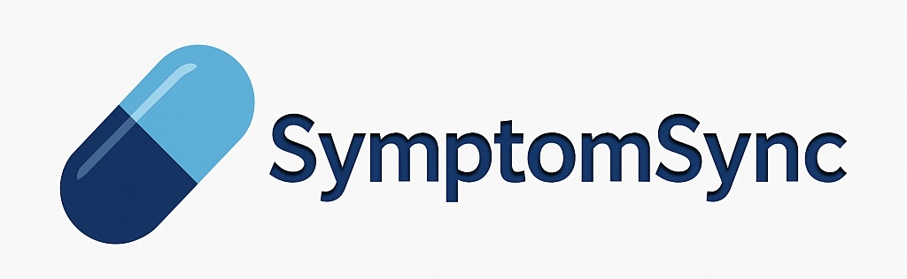
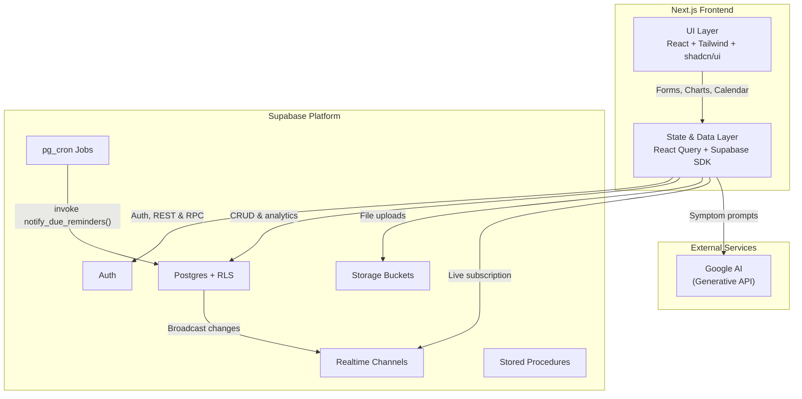
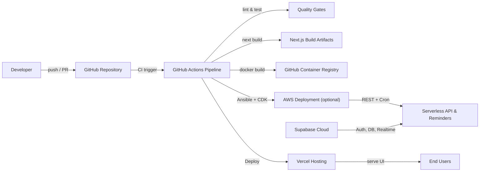
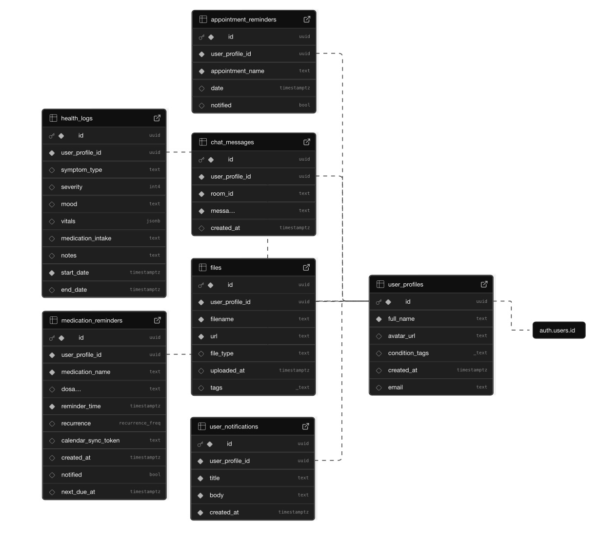
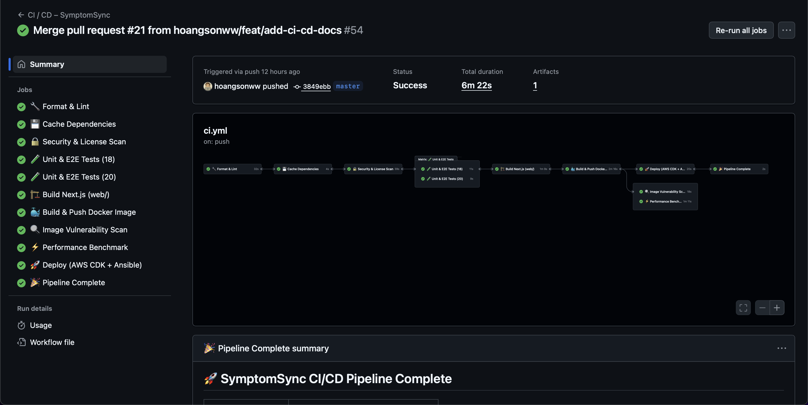

# SymptomSync - A Health Management Web App 💊

Build with patient care in mind, **SymptomSync** is a web application designed to help users manage their health and wellness. It provides a comprehensive dashboard for tracking medications, appointments, and health logs, all while ensuring real-time synchronization across devices. With features like medication reminders, appointment tracking, and an AI-powered chatbot, **SymptomSync** empowers users to take smarter control of their health journey and live healthier lives 💪.

<p align="center">
  <a href="https://symptomsync.vercel.app" target="_blank">
    
  </a>
</p>

> [!NOTE]
> Developed by [David Nguyen](https://sonnguyenhoang.com) and Erica Ocbu at UNC–Chapel Hill. **© SymptomSync Team, 2025**. 

                             

> [!IMPORTANT]
> **Live Web App: [https://symptomsync.vercel.app](https://symptomsync.vercel.app) 🚀**

## Table of Contents

1. [SymptomSync UI](#symptomsync-ui)
2. [Features](#features)
3. [Tech Stack](#tech-stack)
4. [Architecture Overview](#architecture-overview)
5. [Installation](#installation)
6. [Configuration](#configuration)
7. [Supabase Schema](#supabase-schema)
8. [Usage](#usage)
9. [Agentic AI](#agentic-ai)
10. [Video Demo](#video-demo)
11. [High-Fidelity Prototype](#high-fidelity-prototype)
12. [AWS & Ansible Deployment](#aws--ansible-deployment)
13. [GitHub Actions CI/CD](#github-actions-cicd)
14. [Testing](#testing)
15. [Contributing](#contributing)
16. [Authors](#authors)
17. [License](#license)
18. [Acknowledgements](#acknowledgements)

## SymptomSync UI

The UI of the app was designed with Figma and Tailwind CSS. The design is responsive and mobile-first, ensuring a seamless experience across devices. Below are some screenshots of the app in action:

### Home Dashboard

<p align="center">
  
</p>

### Calendar View

<p align="center">
  
</p>

### Documents Page

<p align="center">
  
</p>

### Medication Reminders

<p align="center">
  
</p>

### Chatbot UI

<p align="center">
  
</p>

### Profile Page

<p align="center">
  
</p>

### Auth

<p align="center">
  
</p>

### Dark Mode

<p align="center">
  
</p>

### Barcode/QR Code Scanning

<p align="center">
  
</p>

... and so many more! Explore [our app](https://symptomsync.vercel.app) to see the full range of features and functionality.

> [!IMPORTANT]
> Link to Figma prototype: [SymptomSync Figma Prototype](https://www.figma.com/design/YwoQ1OgAPYOfFOwlbf3aP0/COMP-426-Final-Project-Prototype?node-id=2-287&t=yC99fAWyYGJEOY3N-1)

## Features

SymptomSync offers a range of features to help users manage their health effectively:

- **Medication Reminders**: Schedule, edit, and delete recurring or one‑off med alerts.
  - **QR/Barcode Scanning**: Scan medication QR codes to auto-fill details. This can save time and reduce errors when entering medication information!
- **Appointment Tracking**: Log upcoming appointments with date/time and manage them.
- **Health Logs**: Record symptoms, mood, vitals, and notes; visualize trends over time.
- **Dashboard Visualizations**: Interactive charts for severity trends, symptom & mood distribution, and more.
- **Real‑Time Updates**: Broadcast channel notifications and Supabase Realtime keep all devices in sync instantly.
- **Pagination**: Efficient paginated fetching for large datasets (meds, appts, logs).
- **Notifications**: In-app reminders for due medications and appointments.
- **ICS Export/Import**: Export all events as an ICS calendar file or import from external calendars.
- **Calendar View**: Month/week/day/agenda views for all events, with drag-and-drop support.
- **Documents Page**: Upload/export and manage documents related to health records, prescriptions, etc.
- **Chatbot**: AI-powered chatbot for symptom analysis and health insights.
- **User Profiles**: Create and manage user profiles with personalized settings.
- **Medication Schedules**: Set up complex medication schedules with reminders.
- **Login/Signup**: Secure authentication via Supabase Auth.
- **Reset Password**: Password reset functionality for user accounts.
- **Dark Mode**: Toggle between light and dark themes for better accessibility.
- **Responsive Design**: Mobile-first design with a focus on usability across devices.

## Tech Stack

- **Front-End**
  - Next.js & React (TypeScript)
  - Tailwind CSS & Shadcn/ui components
  - Framer Motion for animations
  - react-chartjs-2 & Chart.js for charts
  - react-query for data fetching & caching
  - react-calendar for calendar view
  - lucide-icons for icons
- **Back-End / Data**
  - Supabase (Auth, Postgres, Realtime, Storage, Cron)
- **Notifications & Sync**
  - Supabase Postgres Triggers for real-time updates
  - Supabase Cron Jobs for scheduled reminders
  - Supabase Broadcast Channels & `postgres_changes` for live updates & notifications

## Architecture Overview

The diagrams below summarize how SymptomSync is assembled across the client, data services, and deployment workflows. A much deeper dive (with additional sequence and ER diagrams) lives in [ARCHITECTURE.md](ARCHITECTURE.md).





- **Supabase**: The backend is powered by Supabase, which provides a Postgres database, authentication, and real-time capabilities.
  - Each table is protected by **Row Level Security (RLS)** policies to ensure user data isolation, so that users can only access/update/delete their own data.
- **Realtime Broadcast**: Any create/update/delete triggers both a `postgres_changes` subscription and a broadcast message so all open clients show a toast notification.
- **Cron Jobs**: Scheduled jobs (via Supabase Cron) that scan upcoming reminders and dispatch notifications every second.
> [!CAUTION]
> If the window loses focus, or when you have a slow connection, the reminder notifications may not show up. Also, the cron jobs are not guaranteed to run at the exact time specified, but they will run within a few seconds of the scheduled time.
- **Postgres Triggers**: Database triggers that listen for changes in the `medication_reminders`, `appointment_reminders`, and `health_logs` tables, and send messages to the broadcast channel.
  - There is also a trigger on the `auth.users` table to create a corresponding `user_profiles` entry when a new user signs up.
- **AI Chatbot**: The chatbot uses the Google AI API to analyze user symptoms and provide health insights.

## Installation

1. Clone the repo

   ```bash
   git clone https://github.com/hoangsonww/SymptomSync-Health-App.git
   cd SymptomSync-Health-App
   ```

2. Open the project in your favorite code editor (e.g., VSCode). When prompted by your IDE, select "Open in Container" to open the project in a Docker container. Alternatively, if using VSCode, you can use the Remote - Containers extension to open the project in a container.
> [!CAUTION]
> This is very important as the project uses Docker to run the database and other services. If you don't have Docker installed, please install it first.
3. Install dependencies (Remember to use `--legacy-peer-deps` if you encounter issues with React versions being incompatible with Shadcn/ui)
   ```bash
   npm install --legacy-peer-deps
   ```
4. Copy `.env.example` → `.env.local` and fill in your Supabase credentials
   ```bash
   NEXT_PUBLIC_SUPABASE_URL=…
   NEXT_PUBLIC_SUPABASE_ANON_KEY=…
   NEXT_PUBLIC_GOOGLE_AI_API_KEY=…
   ```
5. Run the dev server
   ```bash
   npm run dev
   ```

## Configuration

- **Supabase**

  - Configure **Auth** settings in the Supabase dashboard
    - Enable email/password signups
    - Uncheck the confirmation email option for now
  - Create tables: `user_profiles`, `medication_reminders`, `appointment_reminders`, `health_logs`, `files`, and `user_notifications` and enable Realtime for all of them.
    - Set relationships between tables using Foreign Keys.
  - Add RLS policies for user isolation to the tables. All tables should have the following policies or similar:
    - `select`: `auth.uid() = user_profile_id`
    - `insert`: `auth.uid() = user_profile_id`
    - `update`: `auth.uid() = user_profile_id`
    - `delete`: `auth.uid() = user_profile_id`
  - Set up **Cron** jobs to run `send_reminders()` stored procedure daily/hourly or even every second.
    - To do so, you might need to enable the `pg_cron` extension in your Supabase project.
  - Create **Postgres Functions** to handle the logic for sending notifications and reminders
    - `send_reminders()`: Check for upcoming reminders and send notifications
    - `create_user_profile()`: Create a new user profile when a user signs up
  - Define **Database Triggers** to write to broadcast channels on insert/update/delete and to create a new user profile on signup
  - Set up **Storage** for file uploads. Create 2 buckets: `avatars` and `documents`

- **Environment**
  - `.env.local` holds all keys (refer to `.env.example`)
  - Default port: `3000`

## Supabase Schema

SymptomSync uses the following tables in Supabase:

- `user_profiles`
- `medication_reminders`
- `appointment_reminders`
- `health_logs`
- `files`
- `user_notifications`
- `auth.users` (Supabase Auth table)
- `auth.refresh_tokens` (Supabase Auth table)
- `auth.user_attributes` (Supabase Auth table)
- `auth.user_mfa` (Supabase Auth table)
- and more...

These tables are used to store user profiles, medication reminders, appointment reminders, health logs, uploaded files, and user notifications. The schema is designed to ensure data integrity and security through Row Level Security (RLS) policies.

Below is a diagram of the Supabase schema used in SymptomSync:

<p align="center">
  
</p>

## Usage

1. Sign up / log in via Supabase Auth.
2. On the **Home** dashboard, add new medications, appointments, or health logs.
3. View interactive charts - severity trends, symptom distribution, appointment patterns.
4. Navigate to **Calendar** to see a month/week/day/agenda view of all events, add events, or even import/export ICS.
5. All changes sync in real‑time across open tabs/devices; cron‑driven reminders notify you via in-app notifications.
6. Use the **Documents** page to upload/export health records, prescriptions, etc.
7. Chat with the **AI Chatbot** for symptom analysis and health insights.
8. Toggle between light and dark mode for better accessibility.
9. View and manage your **profile**. You can also vies other users' profiles.
10. Visit the **Medication Schedules** page to view/edit a complete list of your medications and their schedules.

## Agentic AI

SymptomSync incorporates Agentic AI to enhance user experience and provide personalized health insights. The AI analyzes user data, identifies patterns, and offers tailored recommendations for medication management, appointment scheduling, and health tracking.
- **Symptom Analysis**: The AI chatbot can analyze user-reported symptoms and provide insights based on medical knowledge.
- **Personalized Reminders**: The AI can suggest optimal times for medication reminders based on user routines and habits.
- **Health Trend Predictions**: By analyzing health logs, the AI can predict potential health trends and alert users to take preventive actions.
- **Natural Language Processing**: The AI chatbot uses NLP to understand user queries and provide relevant responses in a conversational manner.

For more details on how Agentic AI is integrated into SymptomSync, refer to the [AI Integration Documentation](agentic_ai/README.md).

## Video Demo

Check out our demo video showcasing the app's features and functionality: [Link to Demo Video](https://drive.google.com/file/d/1DKOIBnTep6rMrOBSRWPVhk2s8g8uIYef/view?usp=sharing)

<p align="center">
  <a href="https://drive.google.com/file/d/1DKOIBnTep6rMrOBSRWPVhk2s8g8uIYef/view?usp=sharing" target="_blank">
    
  </a>
</p>

> [!TIP]
> This video might not be comprehensive and cover all features of our app - so please feel free to give our live app at [symptomsync.vercel.app](https://symptomsync.vercel.app) a try to test out all the features!

## High-Fidelity Prototype

Link to Figma prototype: [SymptomSync Figma Prototype](https://www.figma.com/design/YwoQ1OgAPYOfFOwlbf3aP0/COMP-426-Final-Project-Prototype?node-id=2-287&t=yC99fAWyYGJEOY3N-1)

Our high-fidelity prototype showcases the app's design and user experience. You can interact with the prototype to get a feel for how the app works.

<p align="center">
  <a href="https://www.figma.com/design/YwoQ1OgAPYOfFOwlbf3aP0/COMP-426-Final-Project-Prototype?node-id=2-287&t=yC99fAWyYGJEOY3N-1" target="_blank">
    
  </a>
</p>

## AWS & Ansible Deployment

SymptomSync now fully supports Amazon Web Services (AWS) deployment alongside Vercel if you choose to host your own instance on AWS! Its deployment infra is defined in the `aws/` folder (AWS CDK in JavaScript) and can be deployed via the Ansible playbook in `ansible/`. This setup will provision Cognito, DynamoDB, S3, Lambdas, API Gateway and a scheduled EventBridge rule - and automate it all via Ansible.

### Directory Layout

```
.
├── aws/           # CDK v2 stack (JavaScript)
│   ├── bin/
│   ├── lib/
│   ├── lambda/
│   ├── package.json
│   ├── cdk.json
│   └── .gitignore
└── ansible/       # Ansible deployment playbook
├── ansible.cfg
├── inventory.ini
└── deploy-infrastructure.yml

```

### AWS CDK

1. **Bootstrap & Deploy**  
  ```bash
   cd aws
   npm install
   cdk bootstrap
   cdk deploy --require-approval never
  ```

2. **What’s created**

   * **Cognito** User Pool & App Client
   * **DynamoDB** tables for profiles, meds, appts, logs, notifications
   * **S3** buckets (`avatars`, `documents`)
   * **Lambda** functions: REST API, reminder processor, chatbot, presigned-URL
   * **API Gateway** (REST) + Cognito authorizer
   * **EventBridge** rule to run reminders every minute

### Ansible Playbook

1. **Run the playbook**

   ```bash
   cd ansible
   ansible-playbook deploy-infrastructure.yml
   ```
2. **What it does**

   * Installs Node.js, AWS CLI, AWS CDK on the host
   * Verifies your `GOOGLE_AI_API_KEY` env var
   * Bootstraps CDK in your AWS account
   * Deploys the entire SymptomSync stack non-interactively

Ensure your AWS credentials (via `AWS_PROFILE` or `AWS_ACCESS_KEY_ID`/`AWS_SECRET_ACCESS_KEY`) and `GOOGLE_AI_API_KEY` are set in your environment before running.

## GitHub Actions CI/CD

We have set up GitHub Actions for continuous integration and deployment. The workflow runs on every push to the `main` branch and performs the following steps:

- Installs dependencies
- Runs tests
- Builds the application
- Deploys to Vercel 
- Deploys the AWS stack using the Ansible playbook
- Notifies the team on success/failure

For more details, check out the `.github/workflows/ci.yml` file in the repository.

<p align="center">
  
</p>

## Testing

We have implemented unit tests using Jest to ensure the reliability of our application. The tests cover various components and functionalities, including:

- User authentication
- Data fetching and state management
- API integration
- UI components

To run the tests, use the following command in the `web` directory:

```bash
npm run test
```

## Contributing

1. Fork & branch: `git checkout -b feature/awesome`
2. Develop something awesome
3. Install & format: `npm install && npm run format`
4. Commit & PR with description
5. Wait for review and merge

## Authors

A big thank you to our team members for their hard work and dedication:

- [David Nguyen](https://github.com/hoangsonww)
- [Erica Ocbu](https://github.com/ericaocbu)

## License

[MIT License](LICENSE) - Feel free to use, modify, and distribute this code as you wish. Contributions are welcome!

Please ensure to follow the [Contributing Guidelines](#contributing) if you wish to contribute to this project.

## Acknowledgements

We would like to acknowledge the following resources and libraries that made this project possible:

- [Next.js](https://nextjs.org) for the React framework
- [Supabase](https://supabase.io) for the backend services
- [Tailwind CSS](https://tailwindcss.com) for the styling framework
- [Shadcn/ui](https://ui.shadcn.com) for the UI components
- [Framer Motion](https://www.framer.com/motion/) for the animations
- [Chart.js](https://www.chartjs.org) for the data visualizations
- [Google AI](https://ai.google) for the AI-powered chatbot
- [Docker](https://www.docker.com) for containerization
- [Ansible](https://www.ansible.com) for deployment automation 
- [AWS CDK](https://aws.amazon.com/cdk/) for infrastructure as code
- [Figma](https://www.figma.com) for the design and prototyping
- [Postman](https://www.postman.com) for API testing
- [Jest](https://jestjs.io) for testing
- [ESLint](https://eslint.org) for code linting
- [Prettier](https://prettier.io) for code formatting
- and many more!

## Contact

For any questions, feedback, or contributions, feel free to open an issue [here](https://github.com/hoangsonww/SymptomSync-Health-App/issues) or reach out to us via [GitHub Discussions](https://github.com/hoangsonww/SymptomSync-Health-App/discussions). We appreciate your interest in **SymptomSync** and look forward to hearing from you!

---

Thank you for checking out **SymptomSync**! We hope it helps you manage your health and wellness effectively. If you have any questions or feedback, feel free to reach out! 💊

[🔝 Back to Top](#symptomsync---a-health-management-web-app-)
