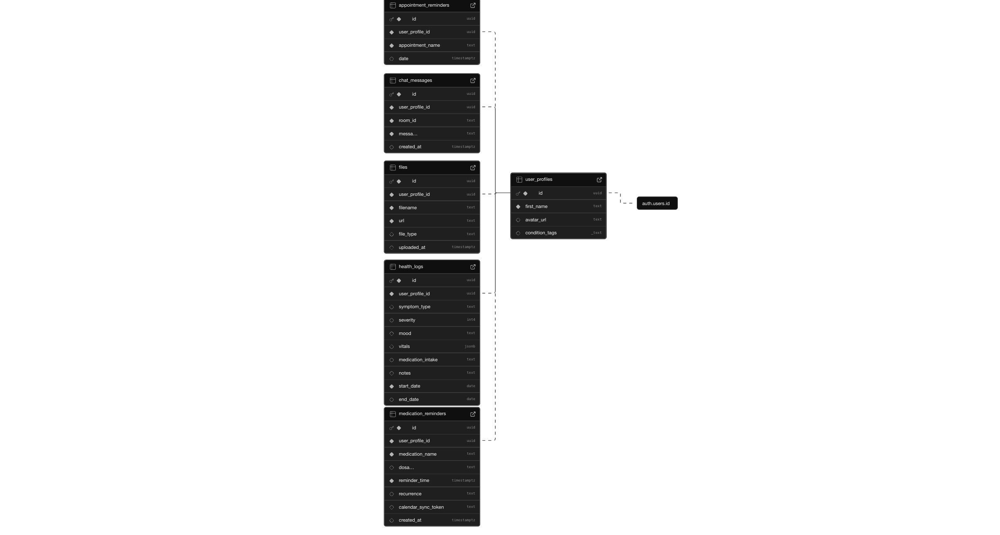

# Design Document

> Written by: David Nguyen and Erica Ocbu for COMP 426: Modern Web Programming at UNC-Chapel Hill.

## Feature Plan

### Feature 1: Daily Health Log

**Description:** A comprehensive log where users can record daily symptoms, medication intake, doctor appointments, vital signs, and mood entries.

**User(s):** Anyone managing a chronic condition or simply wanting to track their daily health metrics.

**Purpose:** To provide users with an easy way to capture and monitor health data over time, aiding in trend identification and more informed healthcare decisions.

**Technical Notes:** This feature involves user-friendly form inputs and validations on the frontend. Data is stored in a dedicated table in the Supabase Postgres database with fields for date, symptom type, severity, notes, and related metadata. Server-side authentication and role-based access control (RLS) ensure that each user's logs remain private.

---

### Feature 2: Interactive Health Trend Charts

**Description:** Dynamic charts that visualize trends in user health data (e.g., symptom severity, mood, and vitals) over time.

**User(s):** Users who wish to understand long-term patterns in their health data to correlate events or identify triggers.

**Purpose:** To provide a visual representation of health trends, enabling users to identify patterns, monitor improvements or declines, and share insights with healthcare professionals.

**Technical Notes:** Charts will be rendered on the client-side using JavaScript libraries like `Chart.js.` They will subscribe to Postgres change events via Supabase Realtime so that new log entries update the charts automatically.

---

### Feature 3: Medication & Appointment Reminders

**Description:** A system that notifies users for upcoming appointments or medication timing.

**User(s):** Users who require regular medication and benefit from automated reminders about medications and appointments.

**Purpose:** To help users adhere to their medication schedules and reduce the risk of missed doses or appointments.

**Technical Notes:** Medication reminders will be triggered using client-side timers or on-demand checks when users log in. Appointment reminders will be fetched at login or on-demand (refresh).

---

### Feature 4: Peer-Support Chat

**Description:** A chat platform that connects users facing similar health conditions for real-time discussion, support, and resource sharing.

**User(s):** Patients or caregivers who want to connect with peers, share experiences, and offer mutual support.

**Purpose:** To foster a supportive community that can help users manage their conditions through shared experiences, advice, and emotional support.

**Technical Notes:** The chat system utilizes Supabase Realtime broadcast channels to push messages instantly to all connected users in condition-specific chat rooms (which may be similar to Slack or Discord or A07). Frontend components will also subscribe to these channels to render new messages in real time without requiring a page refresh.

---

### Feature 5: Document Upload & Health Report Export

**Description:** A feature allowing users to upload PDF health documents (e.g., doctor notes, lab results, prescriptions) and export summaries of symptoms logged on site.

**User(s):** Users who need to maintain organized records of their health documents and share detailed health reports with their healthcare providers.

**Purpose:** To centralize document management and enable easy sharing of comprehensive health reports, facilitating accurate diagnosis and treatment.

**Technical Notes:** Uploaded documents are stored in Supabase Storage buckets, with corresponding metadata (filename, URL, timestamp) saved in a dedicated "files" table linked to user accounts. The export functionality generates PDF reports on demand using server-side rendering libraries in Next.js, which pull and format data from the database. Secure access policies and role-based access control are also enforced.

---

## Backend Database Schema

**Database Schema Overview**

1. **User Profiles**:  
   The `user_profiles` table is the central table that holds extended user information such as full name, bio, avatar URL, and condition tags. Each profile is directly linked to the Supabase authentication record (`auth.users`) via the `id` field. All other tables reference `user_profiles(id)` to ensure that every piece of data is associated with a registered user.

2. **Health Logs**:  
   The `health_logs` table stores daily health entries for each user. It captures details like log date, symptom type, severity, mood, vitals (as JSON for flexible data structure), medication intake, doctor appointments, and additional notes. Each entry is linked to a user profile to maintain data privacy and integrity.

3. **Medication Reminders**:  
   The `medication_reminders` table records reminders for medication intake. It includes information such as medication name, dosage, reminder time, recurrence, and an optional calendar sync token. These entries are associated with a user profile to enable personalized reminders and potential calendar integrations.

4. **Peer-Support Chat**:  
   The `chat_messages` table handles messages exchanged in condition-specific chat rooms. Each message records the sender’s user profile, the chat room identifier, the message content, and a timestamp. This design supports real-time interactions and community support features.

5. **File Uploads**:  
   The `files` table stores metadata for user-uploaded documents such as PDFs, images, or lab reports. Each file entry contains details like filename, URL (pointing to Supabase Storage), file type, and upload timestamp, all tied back to the corresponding user profile.

---

## High-Fidelity Prototype

Link to Figma prototype: [SymptomSync Figma Prototype](https://www.figma.com/design/YwoQ1OgAPYOfFOwlbf3aP0/COMP-426-Final-Project-Prototype?node-id=2-287&t=yC99fAWyYGJEOY3N-1)

---

### Project Idea Summary

**SymptomSync** is a personal health‑journal web app where users log their daily symptoms, medications, doctor visits/appointments, vitals, and mood. The app generates interactive health trend charts based on user logs and sends reminders about medications and appointments. It also features a peer‑support chat for connecting individuals facing similar conditions, allowing them to share emotional support and resources. Users can upload and store PDF health documents in one centralized location and export shareable health reports.

---
